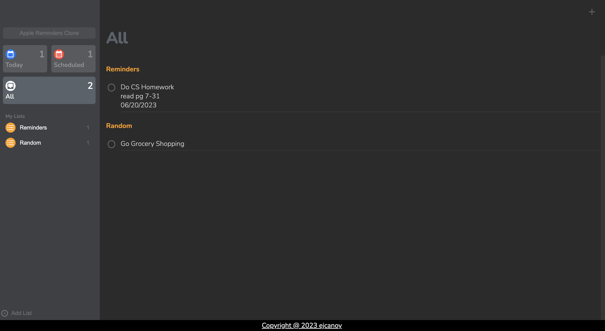
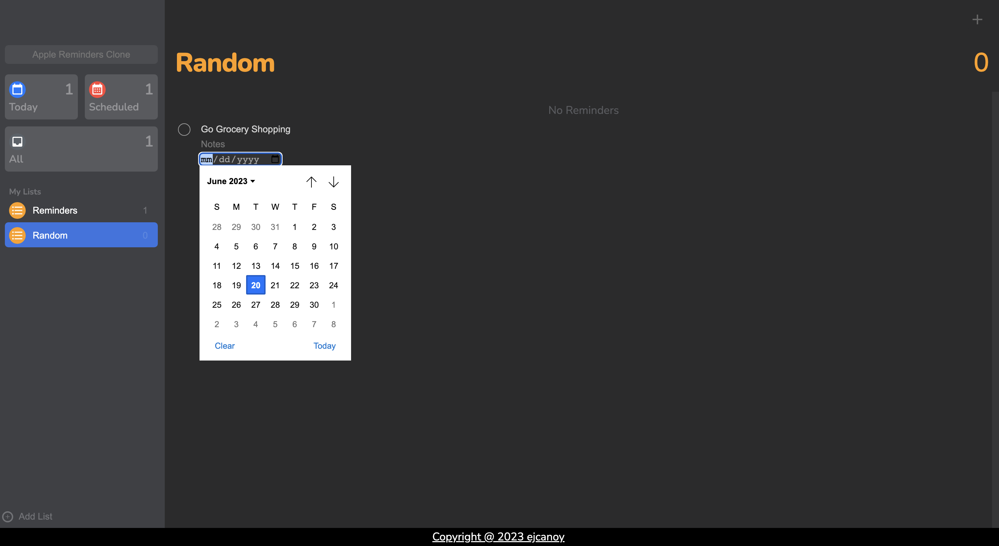

# Reminders Clone

This application serves as a clone of Apple Reminders, providing users with the ability to create, manage, and delete todos and lists. 
The primary objective behind this project was to develop a web application using an object-oriented programming paradigm for enhanced functionality.

